# Operating Systems：Three Easy Piece笔记

Operating Systems：Three Easy Pieces电子书地址https://pages.cs.wisc.edu/~remzi/OSTEP/

这本书从操作系统的3个部分：

- 虚拟化（virtualization）
- 并发（concurrency）
- 持久性（persistence）

操作系统实际上做了：

它取得 CPU、内存或磁盘等物理资源 （resources），甚对它们进行虚拟化（virtualize）。

它处理与甚发（concurrency）有关的麻烦 且棘手的问题。

它持久地（persistently）存储文件，从而使它们长期安全。

<!--more-->

## 第一部分 虚拟化

假设一个计算机只有一个CPU（尽管现代计算机一般拥有2个、4个或者更多CPU），虚拟 化要做的就是将这个CPU虚拟成多个虚拟CPU并分给每一个进程使用因此此，每个应用都 以为自己在独占CPU，但实际上只有一个CPU。这样操作系统就创造了美丽的假象——它 虚拟化了CPU。

### 第4章 进程

- 进程（Process）的非正式定义：就是运行中的程序
- 时分共享（time sharing）CPU技术：通过让一个进程只运行一个时间片，然后切换到其他进程，操作系统提供了存在多个虚拟CPU的假象。

将磁盘中的程序加载到内存中：


- 所有现代操作系统都以某种形式提供以下API。
    - 创建（create）进程
    - 销毁（destroy）进程
    - 等待（wait）进程
    - 其他控制（miscellaneous control），例如让线程暂停一段时间
    - 状态（status），通常也有一些接口可以获得有关进程的状态信息

- 操作系统运行程序要做的事：

    - 操作系统运行程序必须做的第一件事是将代码和所有静态数据加载到内存中的进程的地址空间上。
    - 操作系统还需要为栈（C程序使用栈存放局部变量、函数参数和返回地址）分配内存，也可能为堆分配内存
    - 操作系统还将执行一些其他的初始化任务，特别是与输入/输出（I/O）相关的任务。
    - 最后启动程序， 即main()作为程序的入口。通过跳转到main()，OS将CPU的控制权转移到新创建的进程中，从而程序开始执行。

- 进程可以处于以下三种状态之一：

    - 运行（running）：进程正在处理器上运行。
    - 就绪（ready）：在就绪状态下，进程已准备好运行，但由于某种原因，操作系统选择不在此时运行。
    - 阻塞（blocked）：在阻塞状态下，一个进程执行了某种操作，直到发生其他事件 时才会准备运行。

    ```mermaid
    stateDiagram-v2
        运行 --> 就绪: 取消调度
        运行 --> 阻塞: I/O：发起
        就绪 --> 运行: 调度
        阻塞 --> 就绪: I/O：完成
        
    ```

    从就绪到运行意味着该进程已经被调度（scheduled）。从运行转移到就绪意味着该进程已经取消调度（descheduled）。一旦进程被阻塞（例如，通过发起I/O操作），OS将保持进程的这种状态，直到发生某种事件（例如，I/O完成）。此时，进程再次转入就绪状态（也可能立即再次运行，如果操作系统这样决定）

- 操作系统可能会为所有就绪的进程保留某种进程列表（process list），以及跟踪当前正在运行的进程的一些附加信息。

作业：

### 第5章 进程API

头文件[unistd.h](https://pubs.opengroup.org/onlinepubs/9699919799/basedefs/unistd.h.html)

- 系统调用（System Call），以下函数包含在该头文件中

    - fork()：创建一个子进程

    - wait()：等待其他线程执行结束

    - exec()：将当前运行的程序替换为不同的运行程序，没有创建新的进程，exec()有几种变体：execl()、execle()、execlp()、execv()和 execvp()
    - kill()：向进程发送信号(signal)，包括要求进程睡眠、终止或其他有用的指令
- 调用fork()函数的例子：[p1.c](https://github.com/remzi-arpacidusseau/ostep-code/blob/master/cpu-api/p1.c)
- 调用wait()函数的例子：p2.c
- 调用exec()函数的例子：

### 第6章 机制：受限直接执行
> CPU虚拟化的基本思想：运行一个进程一段时间，然后运行另一个进程，如此轮换。通过以这种方式时分共享（time sharing）CPU，就实现了虚拟化。

构建这样的虚拟化机制存在一些问题：
- 第一个是性能：如何在不增加系统开销的情况下实现虚拟化？
- 第二个是控制权：如何有效地运行进程，同时保留对 CPU 的控制？
 
 CPU 虚拟化的关键底层机制，并将其统称为受限直接执行 （limited direct execution）。基本思路很简单：就让你想运行的程序在CPU上运行，但首先确保设置好硬件，以便在没有操作系统帮助的情况下限制进程可以执行的操作。

==解决性能问题：采用受限制的操作==
- 如何高效、可控地虚拟化CPU？
    - 为了使程序尽可能快地运行，操作系统开发人员想出了一种技术——我们称之为受限的直接执行（limited direct execution，LDE）：直接在CPU上运行程序即可
- 硬件通过提供不同的执行模式来协助操作系统。
    - CPU用户模式（user mode）：在用户模式下运行的代码会受到限制。例如，在用户模式下运行时，进程不能发出I/O请求。
    - CPU内核模式（kernel mode）：操作系统（或内核）就以这种模式运行。 在此模式下，运行的代码可以做它喜欢的事，包括特权操作，如发出I/O请求和执行所有类 型的受限指令。
- 如果用户希望执行某种特权操作（如从磁盘读取），可以执行系统调用。要执行系统调用，程序必须执行特殊的陷阱（trap）指令。该指令同时跳入内核并将特权级别提升到内核模式。完成后，操作系统调用一个特殊的从陷阱返回 （return-from-trap）指令，同时将特权级别降低，回到用户模式。

==操作系统重获CPU的控制权：==

- 协作方式：过去某些系统采用的一种方式（例如，早期版本的 Macintosh 操作系统或旧的Xerox Alto 系统）称为协作（cooperative）方式。操作系统相信系统的进程会合理运行。运行时间过长的进程被假定会定期放弃 CPU，以便操作系统可以决定运行其他任务。
- 非协作方式：操作系统进行控制
    - 在非协作方式下，可以利用时钟中断（timer interrput）重新获得CPU的控制权
> 进程以非协作的方式运行，添加时钟中断（timer interrupt）也让操作系统能够在 CPU 上重新运行。因此，该硬件功能对于帮助操作系统维持机器的控制权至关重要。
- 保存和恢复上下文：是继续运行当前正在运行的进程，还是切换到另一个进程。这个决定是由调度程序（scheduler）做出的，它是操作系统的一部分。决定进行切换，OS就会执行一些底层代码，即所谓的上下文切换（context switch）

CPU虚拟化化的关键底层机制，将其称为受限直接执行（limited direct execution，LDE）。基本思路：就让你想运行的程序在CPU上运行，但首先确保设置好硬件，以便在没有操作系统帮助的情况下限制进程可以执行的操作。

**一个LDE协议的例子：**


### 第7章 进程调度
机制（mechanism）和策略（policy）的区别
- 机制：提供并实现确定的功能，比如运行进程的底层机制（如上下文切换）
- 策略：如何使用这些功能


调度指标：

- 周转时间（turnaround time）：$T_{周转时间}=T_{完成时间}-T_{到达时间}$
- 响应时间（response time）：$T_{响应时间} = T_{首次运行}−T_{到达时间}$

调度策略：

- 先进先出（First In First Out或FIFO）调度：先到达的任务先执行。
- 最短任务优先（Shortest Job First，SJF）调度：先运行最短的任务，然后是次短的任务，如此下去
- 最短完成时间优先（Shortest Time-to-Completion First，STCF）调度：向SJF添加抢占，称为最短完成时间优。每当新工作进入系统时，它就会确定剩余工作和新工作中， 谁的剩余时间最少，然后调度该工作。
- 轮转（Round-Robin， RR）调度：RR在一个时间片（time slice，有时称为调度量子，scheduling  quantum）内运行一个工作，然后切换到运行队列中的下一个任务，而不是运行一个任务直到结束。它反复执行，直到所有任务完成。

几种调度策略的图示：


- 重叠（overlap）操作可以最大限度地提高系统的利用率。比如，一个进程在等另一个进程的I/O完成时使用CPU，系统因此得到更好的利用。调度程序与I/O结合，对于STCF调度策略来说，图7.9可以很好地利用资源。将任务A看成5个10ms的子任务，任务A的第一个子任务完成后，发生I/O，此时CPU去处理任务B，等到任务A的第二个子任务到达。根据STCF策略，A的子任务2抢占B的CPU使用权并运行10ms，一个进程在等待另一个进程的I/O完成时使用CPU，系统因此得到更好的利用


- 介绍了调度的基本思想，并开发了两类方法。==第一类是运行最短的工作，从而优化周转时间。第二类是交替运行所有工作，从而优化响应时间。但很难做到“鱼与熊掌兼得”，这是系统中常见的、固有的折中。==

### 第8章 多级反馈队列

- 著名的调度方法：多级反馈队列（Multi-level Feedback Queue， MLFQ）。多级反馈队列需要解决两方面的问题。首先，它要优化周转时间。其次，需要降低响应时间（MLFQ希望给用户很好的交互体验）。
- 饥饿（starvation）问题：如果系统有“太多”交互型工作，就会不断占用 CPU，导致长工作永远无法得到CPU（它们饿死了）
- 愚弄调度程序（game the scheduler）：用一些卑鄙的手段欺骗调度程序，让它给你远超公平的资源。进程在时间片用完之前，调用一个I/O操作（比如访问一个无关的文件），从而主动释放CPU。如此便可以保持在高优先级，占用更多的CPU时间。做得好时（比如，每 运行99%的时间片时间就主动放弃一次CPU），工作可以几乎独占CPU。 
- 优化后的MLFQ规则：
    - 规则1：如果A的优先级 > B的优先级，运行A（不运行B）。  
    - 规则2：如果A的优先级 = B的优先级，轮转运行A和B。 
    - 规则3：工作进入系统时，放在最高优先级（最上层队列）。  
    - 规则4：为了解决愚弄问题，一旦工作用完了其在某一层中的时间配额（无论中间主动放弃了多少次 CPU），就降低其优先级（移入低一级队列）。 
    - 规则5：为了避免挨饿问题，经过一段时间S，就将系统中所有工作重新加入最高优先级队列。 
- 大多数的MLFQ变体都支持不同队列可变的时间片长度。高优先级队列通常只有较短的时间片（比如 10ms 或者更少），因而这一层的交互工作可以更快地切换。相反，低优先级队列中更多的是 CPU 密集型工作，配置更长的时间片会取得更好的效果。

### 第9章  比例份额

- 调度程序——比例份额（proportional-share）调度程序，有时也称为公平份额（fair-share）调度程序。比例份额算法基于一个简单的想法：调度程序的最终目标，是确保每个工作获得一定比例的CPU时间，而不是优化周转时间和响应时间。
- 比例份额的两种实现：彩票调度和步长调度。但由于一些原因，并没有作为CPU调度程序被广泛使用。一 个原因是这两种方式都不能很好地适合 I/O

### 第10章 多处理器调度

### 第12章 关于内存虚拟化的对话
- 用户程序生成的每个地址都是虚拟地址（every address generated by a user program is a virtual address）。操作系统只是为每个进程提供一个假象，具体来说，就是它拥有自己的大量私有内存。在一些硬件帮助下，操作系统会将这些假的虚拟地址变成真实的物理地址，从而能够找到想要的信息。

### 第13章 地址空间

- 内存虚拟化：用户程序生成的每个地址都是虚拟地址。操作系统只是为每个进程提供一个假象，具体来说，就是它拥有自己的大量私有内存。在一些硬件帮助下，操作系统会将这些假的虚拟地址变成真实的物理地址，从而能够找到想要的信息。
- 操作系统需要提供一个易用 （easy to use）的物理内存抽象。这个抽象叫作地址空间（address space），是运行的程序看到的系统中的内存。
- 地址空间的例子如下，假设只有这3个部分：代码、栈和堆。当我们描述地址空间时，所描述的是操作系统提供给运行程序的抽象（abstract）。 程序不在物理地址0～16KB的内存中，而是加载在任意的物理地址。


- 虚拟内存（VM）系统的目标
    - 透明（transparency）：程序不应该感知到内存被虚拟化的事实，相反，程序的行为就好像它拥有自己的私有物理内存。在幕后，操作系统（和硬件）完成了所有的工作，让不同的工作复用内存，从而实现这个假象。
    - 效率（efficiency）：效率体现在时间上（即不会使程序运行得更慢）和空间上（即不需要太多额外的内存来支持虚拟化）。在实现高效率虚拟化时，操作系统将不得不依靠硬件支持，包括TLB（第19章会介绍）这样的硬件功能。
    - 保护（protection）：操作系统应确保进程受到保护（protect）， 不会受其他进程影响，操作系统本身也不会受进程影响。保护让我们能够在进程之间提供隔离（isolation）的特性，每个进程都应该在自己的独立环境中运行，避免其他出错或恶意进程的影响。

- 小结
    - 这一章介绍了操作系统的一个重要子系统：虚拟内存。虚拟内存系统负责为程序提供一个巨大的、稀疏的、私有的地址空间的假象，其中保存了程序的所有指令和数据。操作系统在专门硬件的帮助下，通过每一个虚拟内存的索引，将其转换为物理地址，物理内存根据获得的物理地址但获取所需的信息。操作系统会同时对许多进程执行此操作，并且确保程序之间互相不会受到影响，也不会影响操作系统。


### 第14章 内存操作API 

- 在运行一个C程序的时候，会分配两种类型的内存。
    - 第一种称为栈内存，它的申请和释放操作是编译器来隐式管理的，所以有时也称为自动（automatic）内存。
    - 第二种称为堆（heap）内存，其中所有的申请和释放操作都由程序员显式地完成。

- 内存分配API
    - malloc()：传入要申请的堆空间的大小，它成功就返回一个指向新申请空间的指针，失败就返回NULL
    - realloc()：创建一个新的更大的内存区域，将旧区域复制到其中，并返回新区域的指针。
    - calloc()：分配内存，并在返回之前将其置零
    - free()：释放malloc()函数所分配的堆空间
- malloc()和free()不是系统调用，而是库调用。malloc库管理虚拟地址空间内的空间，但是它本身是建立在一些系统调用之上的，这些系统调用会进入操作系统，来请求本多内存或者将一 些内容释放回系统。

**为什么在你的进程退出时没有内存泄露？**
> 系统中实际存在两级内存管理。
>- 第一级是由操作系统执行的内存管理，操作系统在进程运行时将内存交给进程，并在进程退出（或以其他方式结束）时将其回收。
> - 第二级管理在每个进程中，例如在调用 malloc()和 free()时，在堆内管理。即使你没有调用 free()（并因此泄露了堆中的内存），操作系统也会在程序结束运行时，收回进程的所有内存（包括用于代码、栈，以及相关堆的内存页）。
> 
> 因此，对于短时间运行的程序，泄露内存通常不会导致任何操作问题

### 第15章 地址转换

- 地址转换（address translation）：硬件对每次内存访问进行处理（即指令获取、数据读取或写入），将指令中的虚拟（virtual）地址转换为数据实际存储的物理（physical）地址。

- 动态重定位（dynamic relocation）：基于硬件。每个CPU需要两个硬件寄存器：基址（base）寄存器和界限（bound）寄存器，有时称为限制（limit）寄存器。

    - 基址寄存器：存放物理地址的首地址
    - 界限寄存器：界限寄存器提供了访问保护，例如进程拥有4KB大小的地址空间，这个寄存器的值就是4KB

- 动态重定位具体原理：操作系统决定将某个进程加载到32KB的内存地址，因此将基址寄存器设置为这个值。于是有`物理地址=虚拟地址+基地址`。进程中使用的内存引用都是虚拟地址（virtual address），硬件接下来将虚拟地址加上基址寄存器中的内容，得到物理地址（physical address），再发给内存系统。 由于这种重定位是在运行时发生的，而且我们甚至可以在进程开始运行后改变其地址空间，这种技术一般被称为动态重定位（dynamic relocation）
- 内存管理单元：有时我们将CPU的这个负责地址转换的部分统称为内存管理单元（Memory Management Unit，MMU）。

转换示例：假设一个进程拥有4KB大小地址空间，它被加载到从16KB开始的物理内存中。转换结果如下表

| 虚拟地址 |      |           物理地址            |
| :------: | :--: | :---------------------------: |
|    0     |  →   |             16KB              |
|   1KB    |  →   |             17KB              |
|   3000   |  →   |             19384             |
|   4400   |  →   | 错误（越界），进程大小只有4KB |

- 为了支持动态重定位，硬件添加了新的功能，操作系统也必须提供相应的支持

动态重定位：操作系统的职责

| 操作系统的要求 | 解释                                                         |
| -------------- | ------------------------------------------------------------ |
| 内存管理       | 需要为新进程分配内存<br />从终止的进程回收内存  <br />一般通过空闲列表（free list）来管理内存 |
| 基址/界限管理  | 必须在上下文切换时正确设置基址/界限寄存器                    |
| 异常处理       | 当异常发生时执行的代码，可能的动作是终止犯错的进程           |

### 第16章  分段 

- 如果我们将整个地址空间放入物理内存，那么栈和堆之间的空间并没有被进程使用，却依然占用了实际的物理内存。因此，简单的通过基址寄存器和界限寄存器实现的虚拟内存很浪费。为了解决这个问题，分段（segmentation）的概念应运而生。


- 分段将可分为代码段、堆段、栈段。硬件在地址转换时使用段寄存器，由于栈的地址是从大到小变化，段寄存器需要知道段的增长方向（用一位区分，比如1代表自小而大增长，0反之）。对于地址空间可能存在共享，比如代码段的共享，还需要硬件的支持，这就是保护位（protection bit）。物理内存中存放段，如下表所示

|  段  | 基址 | 大小 | 是否反向增长 |  保护   |
| :--: | :--: | :--: | :----------: | :-----: |
| 代码 | 32KB | 2KB  |      1       | 读-执行 |
|  堆  | 34KB | 2KB  |      1       |  读-写  |
|  栈  | 28KB | 2KB  |      0       |  读-写  |

如上图所示，该例子共有三个段，因此需要两位二进制数来表示。虚拟地址使用二进制形式的前两位表示使用哪个段（假设00表示代码段，01表示堆段，11表示栈段），后面的二进制数位表示段内的偏移量。偏移量与基址寄存器相加，硬件就得到了最终的物理地址。偏移量也简化了对段边界的判断。我们只要检查偏移量是否小于界限， 大于界限的为非法地址。

举个例子，假设访问虚拟地址15KB（上图中栈所在的虚拟地址），该虚拟地址的二进制形式是：11 1100 0000 0000（十六进制0x3C00）。硬件利用前两位（11）来指定栈段，段内偏移量为3KB。由于栈地址是反向增长的，必须从3KB中减去最大的段地址（假设是4KB），因此正确的偏移量是3KB减去4KB，即−1KB。 只要用这个反向偏移量（−1KB）加上基址（28KB），就得到了正确的物理地址 27KB，实现了从虚拟地址15KB到物理地址27KB的转换。

### 第17章 空闲空间管理

- 如果要管理的空闲空间由大小不同的单元构成，管理就变得困难。这种情况出现在用户级的内存分配库（如malloc()和free()），或者操作系统用分段（segmentation） 的方式实现虚拟内存。

**底层机制**
- 内部碎片（internal fragmentation）：已经分配的内存单元内部有未使用的空间（即碎片），造成了浪费。
- 外部碎片（external fragmentation）： 空闲空间被分割成不同大小的小块，成为碎片，后续的请求可能失败，因为没有一块足够大的连续空闲空间，即使这时总的空闲空间超出了请求的大小。 
- 内存分配程序的底层机制
    - 分割：它找到一块可以满足请求的空闲空间，将其分割，第一块返回给用户，第二块留在空闲列表中。
    - 合并：在归还一块空闲内存时，仔细查看要归还的内存块的地址以及邻它的空闲空间块。如果新归还的空间与一个原有空闲块相邻（或两个，就像这个例子），就将它们合并为一个较大的空闲块。

举个例子：
假设有30字节的堆，其对应的空闲列表如下所示，空闲列表中记录了空闲地址的起始地址和大小

1. 如果申请大于10字节的内存会失败，这是因为两块空闲空间的大小都是10字节。
2. 如果申请1个字节的内存，分配程序会执行分割（splitting）：它找到一块可以满足请求的空闲空间，将其分割，第一块返回给用户，第二块留在空闲列表中
3. 合并（coalescing）：在归还一块空闲内存时，仔细查看要归还的内存块的地址以及邻它的空闲空间块。如果新归还的空间与一个原有空闲块相邻（或两个，就像这个例子），就将它们合并为一个较大的空闲块

**追踪已分配空间的大小**
free()函数所需参数只是一个指针，分配程序是怎么知道需要释放多大空间的内存？在使用`malloc()`函数分配时，大多数分配程序都会在头块（header）中保存一点额外的信息（比如内存块的大小）。假设使用`malloc(20)`分配20字节的空间

```c
//简化后的头块
typedef struct header_t {
    int size; 
    int magic; //库可以很容易地确定magic是否符合预期的值，作为正常性检查
} header_t;

//free函数通过指针运算得到头块的位置
void free(void *ptr) { 
    header_t *hptr = (void *)ptr - sizeof(header_t); 
} 
```


**嵌入空闲列表**
到目前为止，我们这个简单的空闲列表还只是一个概念上的存在，它就是一个列表，描述了堆中的空闲内存块。但如何在空闲内存自己内部建立这样一个列表呢？以下是一个节点描述：
```c
typedef struct node_t{
    int size;
    struct node_t *next;
}node_t
```

空闲列表：描述了堆中的空闲内存块的列表
如何在空闲内存自己内部建立这样一个空闲列表？假设一个4KB的堆构建在某块空闲空间上，这块空间通过系统调用 mmap()获得。
```c
// mmap() returns a pointer to a chunk of free space 
node_t *head = mmap(NULL, 4096, PROT_READ|PROT_WRITE, 
    MAP_ANON|MAP_PRIVATE, -1, 0); 
head->size = 4096 - sizeof(node_t); 
head->next = NULL; 
```
一个空闲空间的例子：
最初空闲列表只有一个条目：空闲内存大小为4088个字节，下一个空闲空间的头块的地址为NULL。用户使用malloc()分配到了100个字节（实际上是108个字节）的空间，指针ptr指向该地址。使用free()归还空间时，free()函数通过指针运算得到头块的位置，并将头块后的空间释放掉。遍历空闲列表，合并（merge）相邻块。完成之后，堆又成了一个整体。


**基本策略**
- 最优匹配（best fit）：首先遍历整个空闲列表，找到和请求大小一样或更大的空闲块，然后返回这组候选者中最小的一块。
    - 优点：选择最接它用户请求大小的块，从而尽量避免空间浪费。
    - 缺点：简单的实现在遍历查找正确的空闲块时，要付出较高的性能代价。
- 最差匹配（worse fit）：它尝试找最大的空闲块，分割并满足用户需求后，将剩余的块（很大）加入空闲列表。
    - 优点：不是向最优匹配那样可能剩下很多难以利用的小块。
    - 缺点：需要遍历整个空闲列表。更糟糕的是，会导致过量的碎片，同时还有很高的开销。
- 首次匹配（first fit）：找到第一个足够大的块，将请求的空间返回给用户。
    - 优点：有速度优势（不需要遍历所有空闲块）
    - 缺点：会让空闲列表开头的部分有很多小块
- 下次匹配（next fit）：下次匹配算法与首次匹配相比多了一个指针，该指针指向上一次查找结束的位置。其想法是将对空闲空间的查找操作扩散到整个列表中去，避免对列表开头频繁的分割。这种策略的性能与首次匹配很接它，同样避免了遍历查找。

**其他策略**
- 分离空闲列表（segregated list）：如果某个应用程序经常申请一种（或几种）大小的内存空间，那就用一个独立的列表，只管理这样大小的对象。
- 二分伙伴分配程序（binary buddy allocator）：在这种系统中，空闲空间首先从概念上被看成大小为 2^N^ 的大空间。当有一个内存分配请求时，空闲空间被递归地一分为二，直到刚好可以满足请求的大小（再一分为二就无法满足）。

### 第18章 分页
操作系统有两种方法，来解决大多数空间管理问题。
- 第一种是将空间分割成不同长度的分片，就像虚拟内存管理中的分段。但是，将空间切成不同长度的分片以后，空间本身会碎片化（fragmented），随着时间推移，分配内存会变得比较困难
- 因此，值得考虑第二种方法：将空间分割成固定长度的分片。在虚拟内存中，我们称这种思想为分页。

页与页帧：
- 页（page）：将一个进程的地址空间分割成固定大小的单元，每个单元称为一页。
- 页帧（page frame）：把物理内存看成是定长槽块的阵列。

一个64字节的地址空间与该地址空间到物理内存的映射如下所示，假设每个页的大小为16字节，64字节的地址空间可分成4页。


为了记录地址空间的每个虚拟页放在物理内存中的位置，操作系统通常为每个进程保存一个数据结构，称为页表（page table）。对于这个例子，页表中存在4个条目：（虚拟页 0→物理帧 3）、（VP 1→PF 7）、（VP 2→PF 5）和（VP 3→PF 2）。

**一个地址转换的例子**
为了转换（translate）该过程生成的虚拟地址，我们必须首先将它分成两个组件：虚拟页面号（virtual page number，VPN）和页内的偏移量（offset）。对于上面的例子，进程的虚拟地址空间是64字节，我们的虚拟地址总共需要 6 位（2^6^ = 64）。因为64字节的地址空间分成了4页，所以使用两位二进制数表示VPN，4位二进制数表示页内的偏移量。

假设要转换的虚拟地址是21，将21变成二进制形式“010101”。其中VPN是“01”，偏移量是“0101”。通过虚拟页号，我们现在可以检索页表，找到虚拟页1所在的物理页面。在上面的例子中虚拟页1对应页帧7（物理帧号PFN是7），地址转换过程如下：


**页表存在哪里？**
由于页表如此之大，我们没有在 MMU 中利用任何特殊的片上硬件，来存储当前正在运行的进程的页表，而是将每个进程的页表**存储在内存**中。

**页表中有什么？**
页表中的一个条目称为PTE。操作系统通过虚拟页号（VPN）检索该页表（对于线性页表本质上是数组），并在该索引处查找页表项（PTE），以便找到期望的物理帧号（PFN）。一个x86页表项的例子：


- PFN：physical frame number，物理帧号
- P：存在位（present bit），表示该页是在物理存储器（physical memory）还是在磁盘（disk）上
- D：脏位（dirty bit），表明页面被带入内存后是否被修改过。
- R/W：读写位，确定是否允许写入该页面

页表过大会造成程序运行速度变慢，第19章的TLB是用来解决这个问题。

### 第19章 分页：快速地址转换（TLB）
> 使用分页作为核心机制来实现虚拟内存，可能会带来较高的性能开销。因为要使用分页，就要将内存地址空间切分成大量固定大小的单元（页），并且需要记录这些单元的地址映射信息。因为这些映射信息一般存储在物理内存中，所以在转换虚拟地址时，分页逻辑上需要一次额外的内存访问。每次指令获取、显式加载或保存，都要额外读一次内存以得到转换信息，这慢得无法接受。

**这一章需要解决分页第一个问题：如何加速地址转换。**
地址转换旁路缓冲存储器（translation-lookaside buffer，TLB），它就是频繁发生的虚拟到物理地址转换的硬件缓存（cache），TLB用于加速地址转换。TLB位于CPU内部的内存管理单元MMU。


**示例：访问数组**
为了弄清楚 TLB 的操作，我们来看一个简单虚拟地址追踪，看看 TLB 如何提高它的性能。
```c
int sum = 0;
for(int i = 0; i < 10; i++){
    sum += a[i];
}
```
假设a[0]~a[9]的地址空间中的分布如下：


1. 当访问第一个数组元素（a[0]）时，CPU 会看到载入虚存地址 100。硬件从中提取VPN（VPN=06），然后用它来检查 TLB，寻找有效的转换映射。假设这里是程序第一次访问该数组，结果是 TLB 未命中。
2. 接下来访问a[1]，此时TLB命中。因为数组的第二个元素在第一个元素之后，它们在同一页。因为我们之前访问数组的第一个元素时，已经访问了这一页，所以TLB中缓存了该页的转换映射。因此成功命中。访问 a[2]同样成功（再次命中），因为它和a[0]、a[1]位于同一页。
3. 依次类推，可得10次数组访问操作中TLB的行为表现：未命中、命中、命中、未命中、命中、命中、命中、未命中、命中、命中。

如果页大小变大一倍（32 字节，而不是 16），数组访问遇到的未命中更少。页的大小一般为 4KB， 这种情况下，密集的、基于数组的访问会实现极好的 TLB 性能，每页的访问只会遇到一次未命中。

- 类似其他缓存，TLB 的成功依赖于空间和时间局部性。硬件缓存背后的思想是利用指令和数据引用的局部性（locality）。
    - 时间局部性（temporal locality）：最近访问过的指令或数据项可能很快会再次访问
    - 空间局部性（spatial locality）：当程序访问内存地址x时，可能很快会访问邻近x的内存

**TLB的内容**
一条地址映射可能存在 TLB 中的任意位置，硬件会并行地查找 TLB，找到期望的转换映射。一条TLB项内容可能像这样：VPN ｜ PFN ｜ 其他位

**上下文切换时对 TLB 的处理**
有了 TLB，在进程间切换时（因此有地址空间切换），会面临一些新问题。具体来说，TLB 中包含的虚拟到物理的地址映射只对当前进程有效，对其他进程是没有意义的。上下文切换的时候清空 TLB，这是一个可行的解决方案。但是每次进程运行，当它访问数据和代码页时，都会触发 TLB 未命中。如果操作系统频繁地切换进程，这种开销会很高。为了减少这种开销，一些系统增加了硬件支持，实现跨上下文切换的 TLB 共享。比如地址空间标识符：
- 地址空间标识符（Address Space Identifier，ASID）,可以把ASID看作是进程标识符（Process Identifier，PID），但通常比PID位数少（PID一般32位，ASID一般是8位）

一个例子：MPIS R4000的TLB项

- VPN：虚拟页号
- PFN：物理帧号
- G：全局位（Global），如果全局位置为1，就会忽略ASID
- ASID：地址空间标识符
- C：一致性位（Coherence，C），决定硬件如何缓存该页
- D：脏位（dirty），表示该页是否被写入新数据

### 第20章 分页：较小的表
**这一章需要解决分页第二个问题：页表（page table）太大，因此消耗的内存太多。**
**1. 简单的方法：使用更大的页**
假设一个 32 位地址空间（2^32^ 字节），4KB（2^12^字节）的页和一个 4 字节的页表项。一个地址空间中大约有一百万个虚拟页面（$\frac{2^{32}}{2^{12}}$）。乘以页表项4字节，得到页表大小为4MB（2^22^字节）。现在使用16KB（2^14^字节）的页面，虚拟地址中的偏移量是14位（2^14^B=16KB），VPN需要18位。现在线性页表中有2^18^个项，因此每个页表的总大小为 1MB，页表大小减少到原来的四分之一。
**缺点**：大内存页会导致每页内的浪费，这被称为内部碎片（internal fragmentation）问题（因为浪费在分配单元内部）。因此，大多数系统在常见的情况下使用相对较小的页大小：4KB（如 x86）或 8KB（如 SPARCv9）。

**2. 混合方法：分页和分段**
杂合方法不是为进程的整个地址空间提供单个页表，而是为每个逻辑分段提供一个。
采用混合方法的虚拟地址如下所示：


Seg部分使用两位表示使用的哪个段：假设 00 是未使用的段，01 是代码段，10 是堆段，11 是栈段。
> 杂合方案的关键区别在于，每个分段都有界限寄存器，每个界限寄存器保存了段中最大有效页的值。例如，如果代码段使用它的前 3 个页（0、1 和 2），则代码段页表将只有 3个项分配给它，并且界限寄存器将被设置为 3。内存访问超出段的末尾将产生一个异常，并可能导致进程终止。以这种方式，与线性页表相比，杂合方法实现了显著的内存节省。栈和堆之间未分配的页不再占用页表中的空间（仅将其标记为无效）

**3. 多级列表**
如何去掉页表中的所有无效区域，而不是将它们全部保留在内存中？采用多级列表（multi-level page table）。
> 注：PFN是指Physical Frame Number（物理帧号）或Page Frame Number（页帧号）


多级列表的例子：


在这个例子中，虚拟页0和1用于代码，虚拟页4和5用于堆，虚拟页254和虚拟页255用于栈。共有256个页，假设页表项PTE的大小是4字节，那么页表的大小为1KB（256×4），1KB的页表可表示为可以分为16个64字节的页。这个例子中一页是64字节，可容纳16个PTE。16KB的地址空间需要14位二进制数来表示，该14位的虚拟地址结构如下：


页目录需要为页表的每页提供一个项，共有16页，因此页面目录索引需要4位VPN来索引，要找到这个PTE，我们必须使用VPN的剩余位索引到页表的部分。


假设要查找VPN为254的第0个字节，该虚拟地址为`11 1111 1000 0000`，前四位1111是页目录索引号，即页表目录的第15个条目（从0开始），对应的PDE中的PFN是101，并且有效位是1，表示物理页101有效；第二次查找从页101所在的页表中查找，下四位1110是页表索引，即对应页表中的第14个条目，得到物理页号55；剩下的位数都是表示偏移量，偏移量为0。
可计算出物理地址：`PhysAddr =（PTE.PFN << SHIFT）+ offset = 00 1101 1100 0000 = 0x0DC0`

---

**多级列表例子，使用paging-multilevel-translate.py文件**

这个例子中需要注意：
1. 页面大小是32字节
2. 32KB的虚拟地址空间
3. 物理内存有128个页帧（物理页），共4KB的物理内存（128×32B）

按一页32字节排列的内存块如下所示：
```sh
page 0: 08 00 01 15 11 1d 1d 1c 01 17 15 14 16 1b 13 0b ...
page 1: 19 05 1e 13 02 16 1e 0c 15 09 06 16 00 19 10 03 ...
page 2: 1d 07 11 1b 12 05 07 1e 09 1a 18 17 16 18 1a 01 ...
...
page 33: 7f 7f 7f 7f 7f 7f 7f 7f b5 7f 9d 7f 7f 7f 7f 7f 7f 7f 7f 7f 7f 7f 7f 7f 7f 7f f6 b1 7f 7f 7f 7f
...
page 86: 7f 7f 7f 7f 7f 7f 7f c5 7f 7f 7f 7f 7f 7f 7f 7f 7f 7f 7f 7f ca 7f 7f ee 7f 7f 7f 7f 7f 7f 7f 7f
...
page 108: 83 fe e0 da 7f d4 7f eb be 9e d5 ad e4 ac 90 d6 92 d8 c1 f8 9f e1 ed e9 a1 e8 c7 c2 a9 d1 db ff
...
page 127: ...
```
并且规定PTE的格式如下，VALID表示有效位（1表示有效，0表示无效），PF6~PF0表示物理帧号
```sh
VALID | PFN6 ... PFN0
```
PDE的格式如下，VALID表示有效位（1表示有效，0表示无效），PT6~PT0表示页表号
```sh
VALID | PT6 ... PT0
```


>注：
虚拟地址需要15位，10位用作VPN，5位用作页内偏移量。PDE Index需要占用VPN中的高5位，PTE Index需要占用VPN中的低5位，因为一页最多可容纳32个1字节的PTE。
物理地址需要12位，7位用作PFN，5位用作偏移量。


1.虚拟地址0x611c转换为对应的物理地址
0x611c转为15位二进制数`110 0001 0001 1100`，其中高5位11100（0x18）表示页目录索引（PDE Index），中间5位01000（0x08）表示页表项索引（PTE Index），最后5位表示页内偏移量0x1C。由于PDBR = 108（Page Direction Base Register，页目录基址寄存器），那么需要从第108页（PFN=108）中去查找PDE，根据PDE Index=0x18（24）可获得对应的值是0xa1（有效1，PFN 0X21[十进制33]）。由于PDE中的有效位是1，则表示PFN=33的页表有效。使用PFN=33，去查找对应的PTE。PTE索引是0x08，获得对应的值是0xb5（有效1，PFN 0X35[十进制53]）。于是12位物理地址由7位PFN（0x35）和5位偏移量（0x1C），可得物理地址0x6bc，可得其中的值0x08。
答案：虚拟地址0x611c --> 物理地址0x6bc，该地址中的值是0x08。

可得如下的结果：
```sh
Virtual Address 0x611c:
  --> pde index:0x18 [decimal 24] pde contents:0xa1 (valid 1, pfn 0x21 [decimal 33])
    --> pte index:0x8 [decimal 8] pte contents:0xb5 (valid 1, pfn 0x35 [decimal 53])
      --> Translates to Physical Address 0x6bc --> Value: 0x08
```
2.虚拟地址0x3da8转换为对应的物理地址
0x3da8转为15位二进制数`011 1101 1010 1000`，其中高5位01111（0x0f）表示页目录索引（PDE Index），中间5位011010（0x1a）表示页表项索引（PTE Index），最后5位表示页内偏移量0x08。同样从PFN=108去查找PDE，根据PDE Index=0x0f可得0xd6（有效位1，PFN 0x56），有效位为1表示该条PDE有效，将从PFN=0x56（86）的内存中去查找。根据PTE Index=0x1a可得PTE的内容为0x7f（有效位0，PFN 0x7f），有效位是0，表示该条PTE无效。

最终结果如下：

```sh
Virtual Address 0x3da8:
  --> pde index:0xf [decimal 15] pde contents:0xd6 (valid 1, pfn 0x56 [decimal 86])
    --> pte index:0xd [decimal 13] pte contents:0x7f (valid 0, pfn 0x7f [decimal 127])
      --> Fault (page table entry not valid)
```

### 第21章 超越物理内存：机制
我们需要支持许多同时运行的巨大地址空间。到目前为止，我们一直假设所有页都常驻在物理内存中。但是，为了支持更大的地址空间，操作系统需要把当前没有使用的那部分地址空间找个地方存储起来。在现代系统中，硬盘（hard disk drive）通常能够满足这个需求。因此，在我们的存储层级结构中，大而慢的硬盘位于底层，内存之上。

**交换空间**
交换空间（switch space）：在硬盘上开辟一部分空间用于物理页的移入和移出，在操作系统中，一般这样的空间称为交换空间。一个4页的物理内存和一个8页的交换空间的例子：

3个进程（Proc0、Proc1、Proc2）只有一部分有效页被加载到内存中了，还有一部分存在于交换空间中未被使用。进程3（Proc3）在交换空间中未被加载到物理内存中。

**存在位**
在页表项中添加一条信息：存在位（present bit）。如果存在位设置为1，则表示该页存在于物理内存中；如果存在位设置为0，则页不在内存中，而在硬盘上。访问不在物理内存中的页，这种行为通常被称为页错误（page fault）。

**小结**
> 访问超出物理内存大小的时候，要做到这一点，在页表结构中需要添加额外信息，比如增加一个存在位（present bit，或者其他类似机制），告诉我们页是不是在内存中。如果不存在，则操作系统页错误处理程序（page-fault handler）会运行以处理页错误（page fault），从而将需要的页从硬盘读取到内存，可能需要先换出内存中的一些页，为即将换入的页腾出空间。

###  第22章 超越物理内存：策略
由于内存压力（memory pressure）迫使操作系统换出（paging out）一些页，为常用的页腾出空间。确定要踢出（evict）哪个页（或哪些页）封装在操作系统的替换策略（replacement policy）中。

这章介绍了如下替换策略：
- 最优替换策略：踢出最远将来才会问访问的页。很难实现，因为某一页未来是否被访问是未知的。
- FIFO：先进先出策略。发生替换时，队列尾部的页（“先入”页）被踢出。
- 随机：随机踢出页。
- 最少最近使用（Least-Recently-Used，LRU）：优先踢出最近最少使用的页。
> 随着系统中页数量的增长，扫描所有页的时间字段只是为了找到最精确最少使用的页，这个代价太昂贵。想象一下一台拥有 4GB 内存的机器，内存切成 4KB 的页。这台机器有一百万页，即使以现代 CPU 速度找到 LRU 页也将需要很长时间。。这就引出了一个问题：我们是否真的需要找到绝对最旧的页来替换？找到差不多最旧的页可以吗? 可以使用时钟算法来是实现LRU。

- 时钟算法（clock algorithm）：操作系统使用该算法来近似LRU，以减少计算开销。

> 近似LRU这个想法需要硬件增加一个使用位（use bit，有时称为引用位，reference bit）。系统的每个页有一个使用位，然后这些使用位存储在某个地方（例如，它们可能在每个进程的页表中，或者只在某个数组中）。每当页被引用（即读或写）时，硬件将使用位设置为 1。但是，硬件不会清除该位（即将其设置为 0），这由操作系统负责。

> 时钟算法：有一个简单的方法称作时钟算法（clock algorithm）[C69]。想象一下，系统中的所有页都放在一个循环列表中。时钟指针（clock hand）开始时指向某个特定的页（哪个页不重要）。当必须进行页替换时，操作系统检查当前指向的页 P 的使用位是 1 还是 0。如果是 1，则意味着页面 P 最近被使用，因此不适合被替换。然后，P 的使用位设置为 0，时钟指针递增到下一页（P + 1）。该算法一直持续到找到一个使用位为 0 的页，使用位为 0 意味着这个页最近没有被使用过（在最坏的情况下，所有的页都已经被使用了，那么就将所有页的使用位都设置为 0）。

假设最多缓存3页，页访问序列是0,1,2,1,3,0,3,1,2,1。几种策略示例：
**最优策略**
```sh
ARG addresses 0,1,2,1,3,0,3,1,2,1
ARG addressfile
ARG numaddrs 10
ARG policy OPT
ARG clockbits 2
ARG cachesize 3
ARG maxpage 10
ARG seed 0
ARG notrace False

Solving...

Access: 0  MISS Left  ->          [0] <- Right Replaced:- [Hits:0 Misses:1]
Access: 1  MISS Left  ->       [0, 1] <- Right Replaced:- [Hits:0 Misses:2]
Access: 2  MISS Left  ->    [0, 1, 2] <- Right Replaced:- [Hits:0 Misses:3]
Access: 1  HIT  Left  ->    [0, 1, 2] <- Right Replaced:- [Hits:1 Misses:3]
Access: 3  MISS Left  ->    [0, 1, 3] <- Right Replaced:2 [Hits:1 Misses:4]
Access: 0  HIT  Left  ->    [0, 1, 3] <- Right Replaced:- [Hits:2 Misses:4]
Access: 3  HIT  Left  ->    [0, 1, 3] <- Right Replaced:- [Hits:3 Misses:4]
Access: 1  HIT  Left  ->    [0, 1, 3] <- Right Replaced:- [Hits:4 Misses:4]
Access: 2  MISS Left  ->    [0, 1, 2] <- Right Replaced:3 [Hits:4 Misses:5]
Access: 1  HIT  Left  ->    [0, 1, 2] <- Right Replaced:- [Hits:5 Misses:5]

FINALSTATS hits 5   misses 5   hitrate 50.00

```

**FIFO策略**
```sh
ARG addresses 0,1,2,1,3,0,3,1,2,1
ARG addressfile
ARG numaddrs 10
ARG policy FIFO
ARG clockbits 2
ARG cachesize 3
ARG maxpage 10
ARG seed 0
ARG notrace False

Solving...

Access: 0  MISS FirstIn ->          [0] <- Lastin  Replaced:- [Hits:0 Misses:1]
Access: 1  MISS FirstIn ->       [0, 1] <- Lastin  Replaced:- [Hits:0 Misses:2]
Access: 2  MISS FirstIn ->    [0, 1, 2] <- Lastin  Replaced:- [Hits:0 Misses:3]
Access: 1  HIT  FirstIn ->    [0, 1, 2] <- Lastin  Replaced:- [Hits:1 Misses:3]
Access: 3  MISS FirstIn ->    [1, 2, 3] <- Lastin  Replaced:0 [Hits:1 Misses:4]
Access: 0  MISS FirstIn ->    [2, 3, 0] <- Lastin  Replaced:1 [Hits:1 Misses:5]
Access: 3  HIT  FirstIn ->    [2, 3, 0] <- Lastin  Replaced:- [Hits:2 Misses:5]
Access: 1  MISS FirstIn ->    [3, 0, 1] <- Lastin  Replaced:2 [Hits:2 Misses:6]
Access: 2  MISS FirstIn ->    [0, 1, 2] <- Lastin  Replaced:3 [Hits:2 Misses:7]
Access: 1  HIT  FirstIn ->    [0, 1, 2] <- Lastin  Replaced:- [Hits:3 Misses:7]

FINALSTATS hits 3   misses 7   hitrate 30.00

```

**LRU策略**
```sh
ARG addresses 0,1,2,1,3,0,3,1,2,1
ARG addressfile
ARG numaddrs 10
ARG policy LRU
ARG clockbits 2
ARG cachesize 3
ARG maxpage 10
ARG seed 0
ARG notrace False

Solving...

Access: 0  MISS LRU ->          [0] <- MRU Replaced:- [Hits:0 Misses:1]
Access: 1  MISS LRU ->       [0, 1] <- MRU Replaced:- [Hits:0 Misses:2]
Access: 2  MISS LRU ->    [0, 1, 2] <- MRU Replaced:- [Hits:0 Misses:3]
Access: 1  HIT  LRU ->    [0, 2, 1] <- MRU Replaced:- [Hits:1 Misses:3]
Access: 3  MISS LRU ->    [2, 1, 3] <- MRU Replaced:0 [Hits:1 Misses:4]
Access: 0  MISS LRU ->    [1, 3, 0] <- MRU Replaced:2 [Hits:1 Misses:5]
Access: 3  HIT  LRU ->    [1, 0, 3] <- MRU Replaced:- [Hits:2 Misses:5]
Access: 1  HIT  LRU ->    [0, 3, 1] <- MRU Replaced:- [Hits:3 Misses:5]
Access: 2  MISS LRU ->    [3, 1, 2] <- MRU Replaced:0 [Hits:3 Misses:6]
Access: 1  HIT  LRU ->    [3, 2, 1] <- MRU Replaced:- [Hits:4 Misses:6]

FINALSTATS hits 4   misses 6   hitrate 40.00
```

**近似LRU策略：时钟算法**
```sh
ARG addresses 0,1,2,1,3,0,3,1,2,1
ARG addressfile
ARG numaddrs 10
ARG policy CLOCK
ARG clockbits 2
ARG cachesize 3
ARG maxpage 10
ARG seed 0
ARG notrace False

Solving...

Access: 0  MISS Left  ->          [0] <- Right Replaced:- [Hits:0 Misses:1]
Access: 1  MISS Left  ->       [0, 1] <- Right Replaced:- [Hits:0 Misses:2]
Access: 2  MISS Left  ->    [0, 1, 2] <- Right Replaced:- [Hits:0 Misses:3]
Access: 1  HIT  Left  ->    [0, 1, 2] <- Right Replaced:- [Hits:1 Misses:3]
Access: 3  MISS Left  ->    [0, 1, 3] <- Right Replaced:2 [Hits:1 Misses:4]
Access: 0  HIT  Left  ->    [0, 1, 3] <- Right Replaced:- [Hits:2 Misses:4]
Access: 3  HIT  Left  ->    [0, 1, 3] <- Right Replaced:- [Hits:3 Misses:4]
Access: 1  HIT  Left  ->    [0, 1, 3] <- Right Replaced:- [Hits:4 Misses:4]
Access: 2  MISS Left  ->    [0, 3, 2] <- Right Replaced:1 [Hits:4 Misses:5]
Access: 1  MISS Left  ->    [0, 3, 1] <- Right Replaced:2 [Hits:4 Misses:6]

FINALSTATS hits 4   misses 6   hitrate 40.00
```

**小结**
在许多情况下，由于内存访问和磁盘访问时间之间的差异增加，这些算法的重要性降低了。由于分页到硬盘非常昂贵，因此频繁分页的成本太高。所以，过度分页的最佳解决方案往往很简单：购买更多的内存。


## 第二部分 并发
### 第26章 并发：介绍
线程（thread）是为单个运行进程（process）提供的新抽象。换一个角度来看，每个线程类似于独立的进程，区别在于它们共享地址空间，从而能够访问相同的数据。线程和进程之间的另一个主要区别在于栈。左下图是单线程的地址空间，右下图是多线程的地址空间。
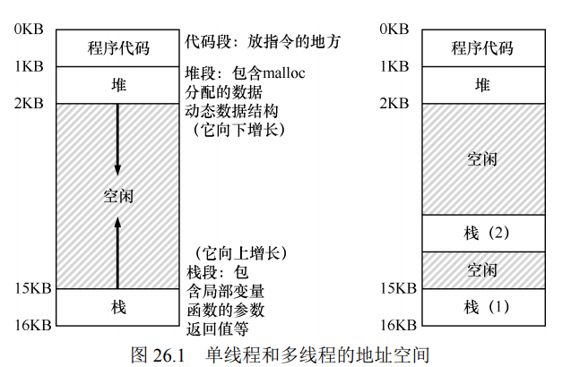

一些术语：
> - 临界区（critical section）：访问共享资源的一段代码，资源通常是一个变量或数据结构。
> - 竞态条件（race condition）出现在多个执行线程大致同时进入临界区时，它们都试图更> 新共享的数据结构。
> - 不确定性（indeterminate）程序由一个或多个竞态条件组成，程序的输出因运行而异，具体取决于哪些线程在何时运行。这导致结果不是确定的（deterministic），而我们通常期望计算机系统给出确定的结果。
> - 为了避免这些问题，线程应该使用某种互斥（mutual exclusion）原语。

### 第27章 插叙：线程API
在POSIX（Portable Operating System Interface of UNIX，可移植操作系统接口）的头文件`pthread.h`有以下这些线程API，可以在[https://pubs.opengroup.org/onlinepubs/7908799/index.html](https://pubs.opengroup.org/onlinepubs/7908799/index.html)中查看这些API的具体描述。
```c
/**
    @brief 创建线程
    @arg    thread：指向pthread_t结构类型的指针，使用该结构体与线程进行交互
            attr：用于指定该线程可能具有的任何属性，通常设置为NULL，表示默认值
            start_routine：函数指针，表示线程从哪个函数开始运行
            arg：要传递给线程开始执行的函数（函数指针指向的函数）的参数
    @return 创建成功返回0，失败则返回对应的错误码

*/
int pthread_create( pthread_t * thread, 
                    const pthread_attr_t * attr, 
                    void * (*start_routine)(void*), 
                    void * arg); 


/**
    @brief 等待线程结束
    @arg   tread: 要等待的线程
           value_ptr: 希望得到的返回值
*/
int pthread_join(pthread_t thread, void **value_ptr); 

```
示例：
```c
#include <pthread.h>
#include <stdio.h>
#include <stdlib.h>
#include <assert.h>

void *mythread(void *arg)
{
    printf("%s: begin\n", (char*)arg);
    printf("%s: end\n", (char*)arg);
}


int main(int argc, char *argv[])
{
    pthread_t p1, p2;
    int rc;
    printf("main: begin\n");
    rc = pthread_create(&p1, NULL, mythread, "A"); assert(rc == 0);
    rc = pthread_create(&p2, NULL, mythread, "B"); assert(rc == 0);

    //等待线程结束
    rc = pthread_join(p1, NULL);
    rc = pthread_join(p2, NULL);

    printf("main: end\n");
    return 0;
}

```
POSIX线程库中的锁（lock）提供为临界区提供互斥。
- 加锁：`int pthread_mutex_lock(pthread_mutex_t *mutex);`
- 解锁：`int pthread_mutex_unlock(pthread_mutex_t *mutex);` 

锁的基本使用：
```c
pthread_mutex_t lock;   //全局锁
pthread_mutex_lock(&lock); 
x = x + 1; // 临界区
pthread_mutex_unlock(&lock); 
```
应该对`rc = pthread_create(&p1, NULL, mythread, "A"); assert(rc == 0);`这样的语句封装一下，有关断言`assert()`参照博客：[【C/C++】详解 assert() 断言](https://blog.csdn.net/weixin_45031801/article/details/136882008)。将其按照如下的方式封装，增加一步断言。
```c
void Pthread_create(pthread_t *thread, const pthread_attr_t *attr,
    void *(*start_routine)(void*), void *arg)
{
    int rc = pthread_create(thread, attr, start_routine, arg);
    assert(rc == 0);    //条件不为真，则断言
}
```

### 第28章：锁

举个使用锁的例子（伪代码）：
```c
lock_t mutex; // 一些全局分配的锁
... 
lock(&mutex); 
balance = balance + 1;      //临界区
unlock(&mutex); 
```

> 锁就是一个变量，因此我们需要声明一个某种类型的锁变量（lock variable，如上面的mutex），才能使用。这个锁变量（简称锁）保存了锁在某一时刻的状态。它要么是可用的（available，或 unlocked，或 free），表示没有线程持有锁，要么是被占用的（acquired，或 locked，或 held），表示有一个线程持有锁，正处于临界区。

POSIX 库将锁称为互斥量（mutex），因为它被用来提供线程之间的互斥。持有锁的线程在临界区时，其他线程就无法进入临界区。
使用POSIX库的锁：
```c
pthread_mutex_t lock = PTHREAD_MUTEX_INITIALIZER;   //初始化锁

Pthread_mutex_lock(&lock); // 将pthread_mutex_lock()封装了一次， 检查获取锁和释放锁时的错误 
balance = balance + 1; 
Pthread_mutex_unlock(&lock); 
```

评价锁的从以下3个方面：
- 能否完成基本目标：提供线程间的互斥
- 公平性（fairness）：是否每一个竞争线程有公平的机会抢到锁
- 性能（performance）：使用锁之后增加的时间开销


==实现锁的一些方案：==
**控制中断**：最早提供的互斥解决方案之一，就是在临界区关闭中断。这个解决方案是为单处理器系统开发的。代码如下：
```c
void lock() { 
    DisableInterrupts();    //关闭中断
} 
void unlock() { 
    EnableInterrupts();     //打开中断
}
```

**测试并设置指令**：如果只是简单的使用flag来标记当前线程是否持有锁，可能会出现两个线程同时将flag设置为1，两个线程都进入临界区的问题。使用这样的方式设计一个锁：
```c
typedef struct lock_t{
    int flag;       //flag=1：线程持有锁，flag=0：没有线程持有锁
}lock_t;

void lock(lock_t *lock)
{
    while(lock->flag == 1)
        ;               //自旋等待该锁可用
    lock->flag = 1;
}

void unlock(lock_t *lock)
{
    lock->flag = 0;
}

void init(lock_t *lock)
{
    lock->flag = 0; 
}
```
假设现在有两个线程：Thread1和Thread2。T1调用`lock()`函数，尝试获取锁，使用while循环来判断标志位，当前flag=0，因此退出while循环；但此时出现了一个中断，切换到T2执行，T2会执行同T1相同的操作，并将flag设置为1。从T2切换到T1时，T1会又一次将flag设置为1，这样两个线程都会进入临界区，并没有实现“互斥”的目标。
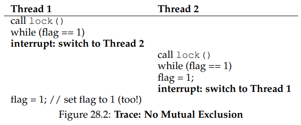

因为关闭中断的方法无法工作在多处理器上，所以系统设计者开始让硬件支持锁。在上一个方案的基础上将测试和设置flag合并为一个原子操作，这样就能保证只有一个线程能获取到锁。`TestAndSet()`函数就是实现这样操作的函数，该函数获取old_ptr所指向的内容，将旧值更新为new，并将旧值返回，C语言伪代码如下：
```c
int TestAndSet(int *old_ptr, int new) { 
    int old = *old_ptr; // fetch old value at old_ptr 
    *old_ptr = new; // store 'new' into old_ptr 
    return old; // return the old value 
}

...

void lock(lock_t *lock)
{
    while(TestAndSet(&lock->flag, 1) == 1)
        ;               //自旋等待该锁可用
    lock->flag = 1;
}
```

**比较并交换指令**：比较并交换的基本思路是检测 ptr 指向的值是否和 expected 相等；如果是，更新 ptr 所指的值为新值。否则，什么也不做。==比较并交换指令比测试并设置更强大==。C语言伪代码如下：
```c
int CompareAndSwap(int *ptr, int expected, int new) { 
    int actual = *ptr; 
    if (actual == expected) 
        *ptr = new; 
    return actual; 
}

...

void lock(lock_t *lock)
{
    while(TestAndSet(&lock->flag, 0, 1) == 1)
        ;               //自旋等待该锁可用
    lock->flag = 1;
}
```

**获取并增加（fetch-and-add）指令**：它能原子地返回特定地址的旧值，并且让该值自增一。C语言伪代码如下：
```c
int FetchAndAdd(int *ptr) { 
    int old = *ptr; 
    *ptr = old + 1; 
    return old; 
} 
```
使用获取并增加指令来实现ticket锁，ticket锁可以保证所有线程都能获得锁。ticket的中文意思有票的意思，这么理解：线程要获取锁，需要先获取lock->ticket作为该线程的次序myturn，当`lock->turn == myturn`时，表示该该线程获取锁，就像看病一样，ticket就是看病的次序。
> ticket锁的基本操作：如果线程希望获取锁，首先对一个 ticket 值执行一个原子的获取并相加指令。这个值作为该线程的“turn”（顺位，即 myturn）。根据全局共享的 lock->turn 变量，当某一个线程的（myturn == turn）时，则轮到这个线程进入临界区。unlock 则是增加 turn，从而下一个等待线程可以进入临界区。

```c
void init(lock_t *lock)
{
    lock->turn = 0;
    lock->ticket = 0;
}

void lock(lock_t *lock)
{
    int myturn = FetchAndAdd(&lock->ticket);
    while(myturn != lock->turn)
        ;   //自旋等待锁可用
}

void unlock(lock_t *lock)
{
    FetchAndAdd(&lock->turn);
}
```

如果临界区的线程发生了上下文切换（进程切换），其他线程只能一直自旋，等待被中断的（持有锁的）线程重新运行。其他线程自旋会浪费CPU，有什么好办法？
方法1：要自旋的时候，放弃 CPU。假定操作系统提供原语 yield()，线程可以调用它主动放弃 CPU，让其他线程运行。
方法2：需要操作系统的更多支持，并需要一个队列来保存等待锁的线程。

### 第29章：基于锁的并发数据结构
在常见的数据结构中使用锁可以使得数据结构线程安全（thread safe）。
#### 并发计数器
以下是一个非并发的不可拓展的计数器
```c
typedef struct counter_t {
	int value;
}counter_t;

void init(counter_t *c) {
	c->value = 0;
}

void increment(counter_t *c) {
	c->value++;
}

void decrement(counter_t *c) {
	c->value--;
}

int get(counter_t *c) {
	return c->value;
}
```
没有同步机制的计数器很简单，只需要很少代码就能实现。现在将使用锁使其变得线程安全：
```c
typedef struct counter_t {
	int value;
	pthread_mutex_t lock;
}counter_t;

void init(counter_t *c) {
	c->value = 0;
	pthread_mutex_init(&c->lock, NULL);
}

void increment(counter_t *c) {
	pthread_mutex_lock(&c->lock);
	c->value++;
	pthread_mutex_unlock(&c->lock);
}

void decrement(counter_t *c) {
	pthread_mutex_lock(&c->lock);
	c->value--;
	pthread_mutex_unlock(&c->lock);
}

int get(counter_t *c) {
	pthread_mutex_lock(&c->lock);
	int rc = c->value;
	pthread_mutex_unlock(&c->lock);
	return rc;
}
```
只是加了一把锁，在调用函数操作该数据结构时获取锁，从调用返回时释放锁。通过加锁实现了计数器的线程安全，接着考虑性能，传统的计数器与懒惰计数器（sloppy counter）的性能比较，图 29.3 给出了运行 1 个线程到 4 个线程的总耗时，
其中每个线程更新 100 万次计数器。本实验是在 4 核 Intel 2.7GHz i5 CPU 的 iMac 上运行。从图 29.3 上方的曲线（标为“精确”）可以看出，同步的计数器扩展性不好。
> 注：这里拓展性是指线程在多核CPU上的运行速度与在单核CPU上运行速度的差异

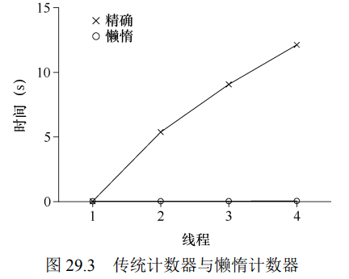

> 懒惰计数器的基本思路：懒惰计数器通过多个局部计数器和一个全局计数器来实现一个逻辑计数器，其中每个CPU 核心有一个局部计数器。具体来说，在 4 个 CPU 的机器上，有 4 个局部计数器和 1 个全局计数器。除了这些计数器，还有锁：每个局部计数器有一个锁，全局计数器有一个。
>  
> 如果一个核心上的线程想增加计数器，那就增加它的局部计数器，访问这个局部计数器是通过对应的局部锁同步的。因为每个 CPU 有自己的局部计数器，不同 CPU 上的线程不会竞争，所以计数器的更新操作可扩展性好。但是，为了保持全局计数器更新（以防某个线程要读取该值），局部值会定期转移给全局计数器，方法是获取全局锁，让全局计数器加上局部计数器的值，然后将局部计数器置零。
> 
> 这种局部转全局的频度，取决于一个阈值，这里称为 S（表示 sloppiness）。S 越小，懒惰计数器则越趋近于非扩展的计数器。S 越大，扩展性越强，但是全局计数器与实际计数的偏差越大。我们可以抢占所有的局部锁和全局锁（以特定的顺序，避免死锁），以获得精确值，但这种方法没有扩展性

假设有4个局部计数器$L_{1} \sim L_{4}$，1个全局计数器$G$，阈值S设置为5，当局部计数器计数值到5后将其加到全局计数器上，并将局部计数器清零。
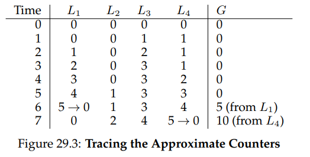

#### 并发链表
这里只实现了链表的插入。
```c
//定义结点
typedef struct node_t{
    int key;
    struct node_t *next;
}node_t;

//定义基于锁的单链表
typedef struct list_t{
    node_t *head;
    pthread_mutex_t lock;
}list_t;

void List_Init(list_t *L)
{
    L->head = NULL;
    pthread_mutex_init(&L->lock, NULL);    //初始化锁
}

int List_Insert(list_t *L, int key)
{
    node_t *new = (node_t*)malloc(sizeof(node_t));    //申请新结点

    if(new == NULL)
    {
        perror("malloc");
        return -1;  //失败
    }

    new->key = key;
    pthread_mutex_lock(&L->lock);   //只在临界区加锁  
    new->next = L->head;     //临界区
    L->head = new;
    pthread_mutex_unlock(&L->lock); 
    return 0;   //成功
}
```
如果方案带来了大量的开销（例如，频繁地获取锁、释放锁），那么高并发就没有什么意义。
注意控制流的变化导致函数返回和退出，或其他错误情况导致函数停止执行。==因为很多函数开始就会获得锁，分配内存，或者进行其他一些改变状态的操作，如果错误发生，代码需要在返回前恢复各种状态，这容易出错==。最好组织好代码，减少这种模式。
应该避免下面这种情况：
```c
int List_Insert(list_t *L, int key)
{
    pthread_mutex_lock(&L->lock);   //只在临界区加锁
    node_t *new = (node_t*)malloc(sizeof(node_t));    //申请新结点

    if(new == NULL)
    {
        perror("malloc");
        pthread_mutex_unlock(&L->lock);     //应避免这种情况
        return -1;  //失败
    }

    new->key = key;
    new->next = L->head;     //临界区
    L->head = new;
    pthread_mutex_unlock(&L->lock); 
    return 0;   //成功
}
```
#### 并发散列表
使用上面的并发链表来实现并发散列表。这个简单的并发散列表扩展性极好，而链表则相反。
```c
void Hash_Init(hash_t *H)
{
    for (int i = 0; i < BUCKETS; i++)
    {
        List_Init(&H->lists[i]);
    }
    
}

int Hash_Insert(hash_t *H, int key)
{
    int index = key % BUCKETS;
    return List_Insert(&H->lists[index], key);
}

int Hash_Lookup(hash_t *H, int key)
{
    int index = key % BUCKETS;
    return List_Lookup(&H->lists[index], key);
}
```

#### 小结
控制流变化时注意获取锁和释放锁；增加并发不一定能提高性能；有性能问题的时候再做优化。

### 第30章：条件变量

#### 定义和程序 

某些时候线程需要检查某一条件（condition）满足之后，才会继续运行，这时候条件变量就发挥作用了。例如，父线程需要检查子线程是否执行完毕，通常被叫做`join()`。
线程可以使用条件变量（condition variable），来等待一个条件变成真。条件变量是一个显式队列，当某些执行状态（即条件，condition）不满足时，线程可以把自己加入队列，等待（waiting）该条件。当线程想唤醒等待在某个条件变量上的睡眠线程时，调用 signal()。
POSIX库中的`wait()`和`signal()`原型如下：
```c
pthread_cond_wait(pthread_cond_t *c, pthread_mutex_t *m); 
pthread_cond_signal(pthread_cond_t *c);
```
可以使用条件变量来代替POSIX库中的`pthread_join()`函数，下面是一个使用条件变量的例子：
```c
int done = 0; 
pthread_mutex_t m = PTHREAD_MUTEX_INITIALIZER; 
pthread_cond_t c = PTHREAD_COND_INITIALIZER; 
 
void thr_exit() { 
    pthread_mutex_lock(&m); 
    done = 1; 
    pthread_cond_signal(&c); 
    pthread_mutex_unlock(&m); 
} 
 
void *child(void *arg) { 
    printf("child\n"); 
    thr_exit(); 
    return NULL; 
} 

void thr_join() { 
    pthread_mutex_lock(&m); 
    while (done == 0) 
        pthread_cond_wait(&c, &m); 
    pthread_mutex_unlock(&m); 
} 
 
int main(int argc, char *argv[]) { 
    printf("parent: begin\n"); 
    pthread_t p; 
    pthread_create(&p, NULL, child, NULL); 
    thr_join();     //等待子线程结束
    printf("parent: end\n"); 
    return 0; 
} 
```
需要特别注意其中的变量**done**是非常有必要存在的，如果不存在该变量，像下面这样：
```c
void thr_exit()
{
    pthread_mutex_lock(&mutex);
    pthread_cond_signal(&c);        //唤醒持有条件变量的其他线程
    pthread_mutex_unlock(&mutex);
}

void thr_join()
{
    pthread_mutex_lock(&mutex);
    pthread_cond_wait(&c, &mutex);
    pthread_mutex_unlock(&mutex);
}
```
像这样就会出现问题。假设子线程立刻运行，并且调用 thr_exit()。在这种情况下，子线程发送信号，但此时却没有在条件变量上睡眠等待的线程。父线程运行时，就会调用 wait并卡在那里，没有其他线程会唤醒它。
==注意：使用条件变量的时候，调用signal和wait时要持有锁。== 像这样：
```c
void thr_join() { 
    pthread_mutex_lock(&m); 
    while (done == 0) 
        pthread_cond_wait(&c, &m); 
    pthread_mutex_unlock(&m); 
} 
```

#### 生产者/消费者（有界缓冲区）问题

多线程程序在检查条件变量时，使用 while 循环总是对的。最终方案解决了两个问题：
1. Mesa语义（Mesa semantic，他们使用的语言是 Mesa，因此而得名）
2. 消费者不应该唤醒消费者，生产者也不会唤醒生产者。

使用while循环代替if来解决问题1，使用两个条件变量来解决问题2.


**最终的生产者/消费者方案**
```c
#define MAX 100

int buffer[MAX];    //共享缓冲区
int fill = 0; 
int use = 0; 
int count = 0; 
int loops = 10;     //生产/消费的个数

pthread_cond_t cond_fill, cond_empty; //两个条件变量
pthread_mutex_t mutex;      //互斥锁    

void put(int value) { 
    buffer[fill] = value; 
    fill = (fill + 1) % MAX; 
    count++; 
} 
 
int get() { 
    int tmp = buffer[use]; 
    use = (use + 1) % MAX; 
    count--; 
    return tmp; 
} 

//消费者线程
void *consumer(void *arg)
{
    for (int i = 0; i < loops; i++)
    {
        pthread_mutex_lock(&mutex);
        while(count == 0)
            pthread_cond_wait(&cond_fill, &mutex);   //当前线程在fill条件变量上睡眠
        int temp = get();
        pthread_cond_signal(&cond_empty);    //唤醒在empty条件变量上睡眠的线程
        pthread_mutex_unlock(&mutex);
        printf("%d\n", temp);
    }
    
}

//生产者线程
void *producer(void *arg)
{
    for (int i = 0; i < loops; i++)
    {
        pthread_mutex_lock(&mutex);
        while(count ==  MAX)
            pthread_cond_wait(&cond_empty, &mutex);   //当前线程在full条件变量上睡眠
        put(i);
        pthread_cond_signal(&cond_fill);    //唤醒在fill条件变量上睡眠的线程
        pthread_mutex_unlock(&mutex);
    }
}
``` 

### 第31章：信号量
信号量（Semaphores）是有一个整数值的对象，可以用两个函数来操作它。在 POSIX 标准中，是`sem_wait()`和 `sem_post()`。
wait()和post()的定义（没有用代码表示）：
```c
int sem_wait(sem_t *s) { 
    decrement the value of semaphore s by one 
    wait if value of semaphore s is negative 
} 
 
int sem_post(sem_t *s) { 
    increment the value of semaphore s by one 
    if there are one or more threads waiting, wake one 
} 

```
其中调用`sem_wait()`会减少信号量s的值，如果信号量s为负数，则等待；`sem_post()`会增加信号量s的值，如果有线程在等待，唤醒其中一个。当信号量的值为负数时，这个值就是等待线程的个数。

#### 二值信号量（锁）
信号量可以当做锁，直接把临界区用一对`sem_wait()`/`sem_post()`环绕。因为锁只有两个状态（持有和未持有），所以这种用法有时也叫作二值信号量（binary semaphore）。对于二值信号量的初始值应该为1。`sem_init()`第二个参数是0，表示信号量是在同一进程的多个线程共享的。
```c
sem_t m;
sem_init(&m, 0, 1);     //将信号量初始化为1

sem_wait(&m);
...             //临界区
sem_post(&m);
```
单线程使用二值信号量的例子如下，信号量初始值为0，线程0调用`sem_wait()`，信号量被减成0，它只会在值小于 0 时等待，于是从`sem_wait()`返回，线程0进入临界区。线程 0 在临界区中，如果没有其他线程尝试获取锁，当它调用`sem_post()`时，会将信号量重置为1。

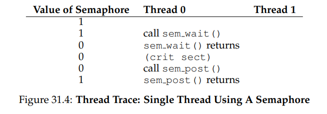


多线程使用二值信号量的例子如下，如果线程 0 持有锁（即调用了 sem_wait()之后，调用 sem_post()之前），另一个线程（线程 1）调用 sem_wait()尝试进入临界区。这种情况下，线程1把信号量减为−1，然后等待（自己睡眠，放弃处理器）。线程 0 再次运行，它最终调用sem_post()，将信号量的值增加到 0，唤醒等待的线程（线程 1），然后线程 1 就可以获取锁。线程 1 执行结束时，再次增加信号量的值，将它恢复为 1。

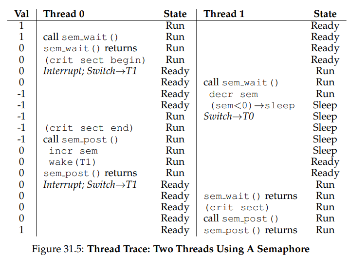

#### 信号量用作条件变量
信号量也可以用在一个线程暂停执行，等待某一条件成立的场景。
```c
void *child(void *arg) {
    printf("child\n");
    sem_post(&s); // signal here: child is done
    return NULL;
}

int main(int argc, char *argv[]) {
    sem_init(&s, 0, 0);     //使用0来初始化信号量
    printf("parent: begin\n");
    pthread_t c;
    pthread_create(&c, NULL, child, NULL);
    sem_wait(&s); // wait here for child
    printf("parent: end\n");
    return 0;
}
```
这个例子中，信号量用作条件变量需要分两种情况：
- 第一种情况，父线程调用 sem_wait()会先于子线程调用 sem_post()。
- 第二种情况，子线程在父线程调用 sem_wait()之前就运行结束

第一种情况：
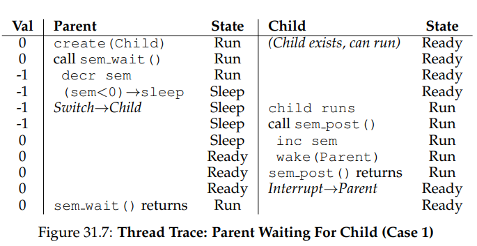

第二种情况：
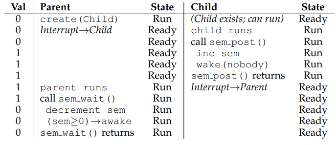

#### 生产者/消费者（有界缓冲区）问题
第30章使用条件变量来解决生产者/消费者问题，这里使用信号量来解决该问题，其中二值信号量mutex发挥着锁的作用，为临界区提供互斥。
最终方案：
```c
int buffer[MAX];
int fill = 0;
int use = 0;

void put(int value) {
    buffer[fill] = value; // Line F1
    fill = (fill + 1) % MAX; // Line F2
}

int get() {
    int tmp = buffer[use]; // Line G1
    use = (use + 1) % MAX; // Line G2
    return tmp;
}

sem_t empty;
sem_t full;
sem_t mutex;

void *producer(void *arg)
{
    int i;
    for(i = 0; i < loops; i++)
    {
        sem_wait(&empty);
        sem_wait(&metux);       //互斥
        put(i);                 //临界区
        sem_post(&metux);
        sem_post(&full);
    }
}

void *consumer(void *arg)
{
    int i;
    for(i = 0; i < loops; i++)
    {
        sem_wait(&full);
        sem_wait(&metux);       //互斥
        int temp = get();       //临界区
        sem_post(&metux);
        sem_post(&empty);
        printf("%d\n", temp);
    }
}

int main(int argc, char *argv[])
{
    sem_init(&empty, 0, MAX);   //信号量empty初始值为MAX
    sem_init(&full, 0, 0);      //信号量full初始值为0
    sem_init(&mutex, 0, 1);     //信号量mutex当作锁使用，初始值为1
    ...
    return 0;
}
```

生产者/消费者问题可能出现死锁（Deadlock）问题，[死锁](https://www.geeksforgeeks.org/handling-deadlocks/)是指一个进程或一组进程被阻塞，等待其他等待进程持有的其他资源的情况。这是系统的一种不良状态。像下面这样：
```c
void *producer(void *arg)
{
    int i;
    for(i = 0; i < loops; i++)
    {
        sem_wait(&metux);       //互斥
        sem_wait(&empty);
        put(i);                 //临界区
        sem_post(&full);
        sem_post(&metux);
    }
}

void *consumer(void *arg)
{
    int i;
    for(i = 0; i < loops; i++)
    {
        sem_wait(&metux);       //互斥
        sem_wait(&full);
        int temp = get();       //临界区
        sem_post(&empty);
        sem_post(&metux);
        printf("%d\n", temp);
    }
}
```
当consumer获得锁时，接着调用`sem_wait(&full)`，由于full初值是0，减一之后变成-1，因此consumer进入睡眠状态；当线程producer调用`sem_wait(&metux)`，由于consumer没有释放锁，线程producer就会一直等待锁被释放，于是就出现了死锁现象。


#### 读写锁（Reader-Writer Locks）
例如，一个并发链表有很多插入和查找操作。插入操作会修改链表的状态（因此传统的临界区有用），而查找操作只是读取该结构，只要没有进行插入操作，我们可以并发的执行多个查找操作。读者—写者锁（reader-writer lock）就是用来完成这种操作。


#### 哲学家就餐问题
> 哲学家就餐问题（dining philosopher’s problem）是一个著名的并发问题，它由 Dijkstra提出来并解决。事实上，Dijkstra 自己也是这样解决的。
假定有5位“哲学家”围着一个圆桌。每两位哲学家之间有一把餐叉（一共 5 把）。哲学家有时要思考一会，不需要餐叉；有时又要就餐。而一位哲学家只有同时拿到了左手边和右手边的两把餐叉，才能吃到东西。关于餐叉的竞争以及随之而来的同步问题，就是我们在并发编程中研究它的原因。

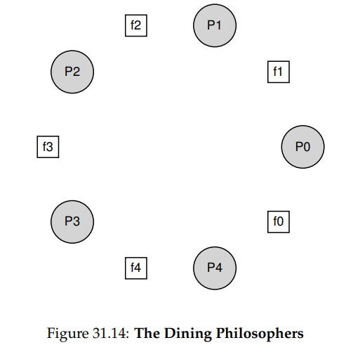
下面是每个哲学家的基本循环
```c
while(1)
{
    think();
    getforks();
    eat();
    putforks();
}
```

关键的挑战就是如何实现 getforks()和 putforks()函数，保证没有死锁，没有哲学家饿死，并且并发度更高（尽可能让更多哲学家同时吃东西）。
构建如下的辅助函数：

```c
int left(int p) { return p; } 
int right(int p) { return (p + 1) % 5; } 
```

模运算解决了最后一个哲学家（p = 4）右手边叉子的编号问题，就是餐叉0。使用5个信号量来表示5个餐叉`sem_t forks[5]`。
实现getforks()和putforks()函数：

```c
void getforks(int p)
{
    sem_wait(left[p]);
    sem_wait(right[p]);
}

void putforks()
{
    sem_post(left[p]);
    sem_post(right[p]);
}
```


==一种解决方案：破除依赖==。修改哲学家4取餐叉的顺序，当编号为4时先获取右边的餐叉再获取左边的餐叉，如下所示。
```c
void getforks() { 
    if (p == 4) { 
        sem_wait(forks[right(p)]); 
        sem_wait(forks[left(p)]); 
    } else { 
        sem_wait(forks[left(p)]); 
        sem_wait(forks[right(p)]); 
    } 
} 
```

#### 如何实现信号量
是POSIX提供的锁和条件变量来实现一个信号量Zemaphore
```c
typedef struct Zem_t{
    int value;
    pthread_mutex_t lock;
    pthread_cond_t cond;
}Zem_t;

void Zem_Init(Zem_t *z, int value)
{
    z->value = value;
    pthread_mutex_init(&z->lock, NULL);
    pthread_cond_init(&z->cond, NULL);
}

void Zem_wait(Zem_t *z)
{
    pthread_mutex_lock(&z->lock);
    while(z->value <= 0)    //信号量的值小于0线程进入休眠
        pthread_cond_wait(&z->cond, &z->lock);
    z->value--;
    pthread_mutex_unlock(&z->lock);
}

void Zem_post(Zem_t *z)
{
    pthread_mutex_lock(&z->lock);
    z->value++;
    pthread_cond_wait(&z->cond, &z->lock);
    pthread_mutex_unlock(&z->lock);
}

```

与Dijkstra 定义的信号量不同，没有保持当信号量的值为负数时，让它反映出等待的线程数。

#### 小结
信号量是编写并发程序的强大而灵活的原语。有程序员会因为简单实用，只用信号量，不用锁和条件变量。

### 第32章：常见并发问题
并发程序中存在的缺陷大致分为**非死锁缺陷**和**死锁缺陷**。
#### 非死锁缺陷
主要讨论其中两种：违反原子性（atomicity violation）缺陷和违反顺序（order violation）缺陷。

**违反原子性缺陷**
> 违反原子性：“违反了多次内存访问中预期的可串行性（即代码段本意是原子的，但在执行中并没有强制实现原子性）”

比如下面这样的代码就是违反原子性：
```c
Thread 1:: 
if (thd->proc_info) { 
    ... 
    fputs(thd->proc_info, ...); 
    ... 
} 
 
Thread 2:: 
    thd->proc_info = NULL; 
```
线程1想要访问thd结构的proc_info成员，但是线程2会把该结构成员设置为空指针，当线程1访问时会出现空指针错误。==解决方案是在访问结构体成员之前增加锁==。
```c
Thread 1::
lock(&mutex); 
if (thd->proc_info) { 
    ... 
    fputs(thd->proc_info, ...); 
    ... 
}
unlock(&mutex);  
 
Thread 2::
lock(&mutex); 
thd->proc_info = NULL; 
unlock(&mutex); 
```
**违反顺序缺陷**

> 违反顺序缺陷：“两个内存访问的预期顺序被打破了（即 A 应该在 B 之前执行，但是实际运行中却不是这个顺序）”。

以下代码是违反顺序缺陷：
```c
Thread 1:: 
void init() { 
    ... 
    mThread = PR_CreateThread(mMain, ...); 
    ... 
} 

Thread 2:: 
void mMain(...) { 
    ... 
    mState = mThread->State; 
    ... 
} 
```
线程2要使用mThread结构的成员，但是如果线程1中还没有创建该结构体，就会空指针出现错误。==解决方案是使用条件变量==，如下所示：
```c
pthread_mutex_t lock = PTHREAD_MUTEX_INITIALIZER; 
pthread_cond_t cond = PTHREAD_COND_INITIALIZER;
int mInit = 0;

Thread 1:: 
void init() { 
    ...
    ptread_mutex_lock(&lock); 
    mThread = PR_CreateThread(mMain, ...); 
    mInit = 1;
    pthread_cond_signal(&cond);
    ptread_mutex_unlock(&lock); 
    ... 
} 

Thread 2:: 
void mMain(...) { 
    ...
    ptread_mutex_lock(&lock);
    while(mInit == 0)
         pthread_cond_wait(&cond, &lock);
    ptread_mutex_unlock(&lock);
    mState = mThread->State;  
    ... 
} 
```
Lu 等人的研究中，大部分（97%）的非死锁问题是违反原子性和违反顺序这两种。因此，程序员仔细研究这些错误模式，应该能够更好地避免它们。
> [L+08]“Learning from Mistakes — A Comprehensive Study on Real World Concurrency Bug Characteristics”
Shan Lu, Soyeon Park, Eunsoo Seo, Yuanyuan Zhou 

#### 死锁缺陷
[死锁（Deadlock）](https://www.geeksforgeeks.org/handling-deadlocks/)是指一个进程（或者线程）或一组进程（或者线程）被阻塞，等待其他等待进程持有的其他资源的情况。这是系统的一种不良状态。死锁依赖图如下所示，线程1持有锁L1，而线程2需要锁L1；线程2持有线程1所需要的锁L2。两个线程相互持有对方所需要的资源，这样就形成了死锁。

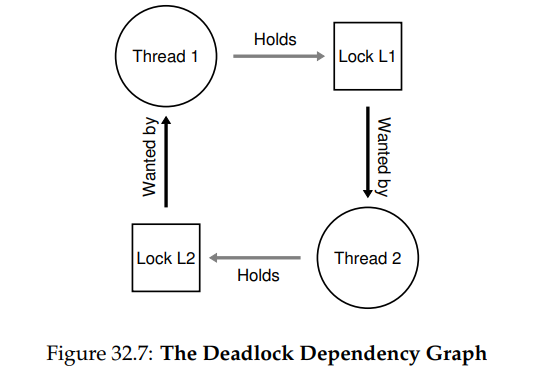

**产生死锁的条件**
死锁的产生需要4个条件。[C+71]
> [C+71]“System Deadlocks”
E.G. Coffman, M.J. Elphick, A. Shoshani ACM Computing Surveys, 3:2, June 1971 
这篇论文概述了死锁的条件以及如何处理它。

- 互斥：线程对于需要的资源进行互斥的访问（例如一个线程抢到锁）。
- 持有并等待：线程持有了资源（例如已将持有的锁），同时又在等待其他资源（例如，需要获得的锁）。
- 非抢占：线程获得的资源（例如锁），不能被抢占。
- 循环等待：线程之间存在一个环路，环路上每个线程都额外持有一个资源，而这个资源又是下一个线程要申请的。

**死锁预防**
1.循环等待
最实用的预防技术（当然也是经常采用的），就是让代码不会产生循环等待。最直接的方法就是获取锁时提供一个全序（total ordering）。假如系统共有两个锁（L1 和 L2），那么我们每次都先申请 L1 然后申请 L2，就可以避免死锁。这样严格的顺序避免了循环等待，也就不会产生死锁。
2.持有并等待
死锁的持有并等待条件，可以通过原子地抢锁来避免。在抢所需要的锁之前，还需要抢一个prevention锁。先抢到 prevention 这个锁之后，代码保证了在抢锁的过程中，不会有不合时宜的线程切换，从而避免了死锁。
```c
lock(prevention); 
lock(L1); 
lock(L2); 
... 
unlock(prevention);
```

3.非抢占
在调用 unlock 之前，都认为锁是被占有的，多个抢锁操作通常会带来麻烦，因为我们等待一个锁时，同时持有另一个锁。trylock()函数会尝试获得锁，或者返回−1，表示锁已经被占有。
```c
top:
    lock(L1);
    if(trylock(L2) == -1){
        unlock(L1);
        goto top;
    }
```
如果另一个线程使用相同的加锁方式，但是不同的加锁顺序（先L2后L1），这样会引来一个新的问题：活锁（livelock）。两个线程有可能一直重复这一序列，又同时都抢锁失败。这种情况下，系统一直在运行这段代码（因此不是死锁），但是又不会有进展，因此名为活锁。活锁的解决方法：例如，可以在循环结束的时候，先随机等待一个时间，然后再重复整个动作，这样可以降低线程之间的重复互相干扰。
4.互斥
Herlihy 提出了设计各种无等待（wait-free）数据结构的思想。想法很简单：通过强大的硬件指令，我们可以构造出不需要锁的数据结构。
假设我们有比较并交换（compare-and-swap）指令，是一种由硬件提供的原子指令，做下面的事：
```c
int CompareAndSwap(int *adress, int expected, int new){
    if(*adress == expected){
        *adress = new;
        return 1;
    }
    return 0;   //失败
}
```
假定我们想原子地给某个值增加特定的数量。我们可以这样实现：
```c
void AtomicIncrement(int *value, int amount){
    do{
        int old = *value;
    }while(CompareAndSwap(value, old, old + amount) == 0);
}
```
无须获取锁，更新值，然后释放锁这些操作，我们使用比较并交换指令，反复尝试将值更新到新的值。这种方式没有使用锁，因此不会有死锁（有可能产生活锁）。

**死锁避免**
在某些场合，可以通过调度的方式避免死锁。如下图所示，线程T1和线程T2都需要L1、L2两个锁，只要T1、T2不同时运行，就不会产生死锁。
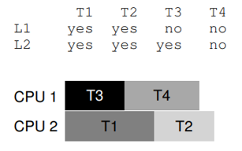

#### 小结
并发缺陷通常分为非死锁缺陷（non-deadlock bugs）和死锁缺陷（deadlock bugs）。
非死锁缺陷：
- 违反原子性
- 违反顺序

实践中是自行设计抢锁的顺序，从而避免死锁发生。锁必然带来各种困难，也许我们应该尽可能地避免使用锁，除非确信必须使用。

## 第三部分 持久性
持久性（persistence）指的是持续性地存储文件，并且掉电不丢失数据。
### 第36章 I/O设备
**本章介绍了减少CPU计算开销的两种方式：**
- 利用中断（interrupt）
- 使用DMA（Direct Memoary Access）进行数据的高效传输

有了中断后，CPU 不再需要不断轮询设备，而是向设备发出一个请求，然后就可以让对应进程睡眠，切换执行其他任务。中断允许计算与I/O重叠（overlap），这是提高CPU利用率的关键。CPU在执行进程1时如果发生I/O请求给磁盘并产生一个中断，CPU就可以切换到进程2去执行，而不是轮询（polling），这样提高了CPU的利用率。如下图所示：
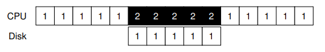
进程 1 在运行过程中需要向磁盘写一些数据，所以它开始进行 I/O 操作，将数据从内存拷贝到磁盘（其中标示 c 的过程）。拷贝结束后，磁盘上的 I/O 操作开始执行，此时 CPU 才可以处理其他请求。
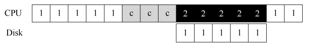
DMA可以协调完成内存和设备间的数据传递，不需要CPU介入。
> DMA工作原理：为了能够将数据传送给设备，操作系统会通过编程告诉 DMA 引擎数据在内存的位置，要拷贝的大小以及要拷贝到哪个设备。在此之后，操作系统就可以处理其他请求了。当 DMA 的任务完成后，DMA 控制器会抛出一个中断来告诉操作系统自己已经完成数据传输。

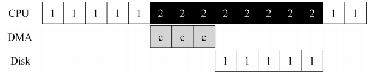

**访问设备的方式**
有两种访问设备的方式：
- 特权指令，例如在 x86 上，in 和 out 指令可以用来与设备进行交互。
- 内存映射I/O（memory- mapped I/O），硬件将设备寄存器作为内存地址提供。当需要访问设备寄存器时，操作系统装载（读取）或者存入（写入）到该内存地址；然后硬件会将装载/存入转移到设备上，而不是物理内存。

### 第37章 磁盘驱动器
磁盘驱动器（hard disk drive）。数十年来，这些驱动器一直是计算机系统中持久数据存储的主要形式，文件系统技术的大部分发展都是基于它们的行为。

#### 基本几何形状
磁盘驱动器大致由以下部分构成：
- 盘片（platter）：它是一个圆形坚硬的表面，通过引入磁性变化来永久存储数据。每个盘片有两面，每面都称为表面。
- 主轴（spindle）：所有盘片都围绕主轴连接在一起，主轴连接到一个电机，以一个恒定的速度旋转盘片（当驱动器接通电源时）。
- 磁头（disk head）：读写过程由磁头完成；驱动器的每个表面有一个这样的磁头。
- 磁盘臂（disk arm）：磁盘臂在表面上移动，将磁头定位在期望的磁道上。

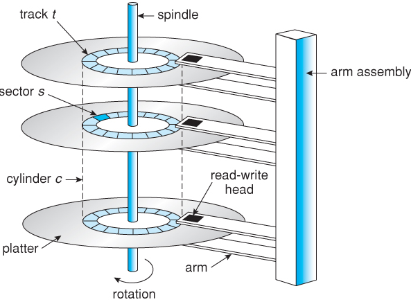

**关键问题：如何存储和访问磁盘上的数据？**
- 现代磁盘驱动器如何存储数据？
- 接口是什么？
- 数据是如何安排和访问的？
- 磁盘调度如何提高性能？

三磁道加上一个磁头如下图所示，磁头从扇区33移动到扇区9所经历的时间称为寻道时间（seek time）
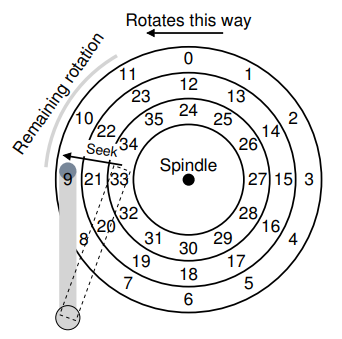


#### I/O时间：用数学
磁盘驱动器完成一次I/O所需要的时间：
$$T_{I/O}=T_{寻道}+T_{旋转}+T_{传输}$$
I/O速率计算公式：
$$ R_{I/O}=\frac{传输大小}{T_{I/O}} $$

#### 磁盘调度
有以下的磁盘调度方式：
- SSTF（Shortest-Seek-Time-First，SSTF），最短寻道时间优先
- Elevator（SCAN或C-CAN），电梯
- SPTF（Shortest Positioning Time First），最短定位时间优先。有时也称为最短接入时间优先，Shortest Access Time First，SATF。

**SSTF：最短寻道时间优先**
当前磁头在最里面的磁道，现在调度请求扇区21和2，根据SSTF策略，磁头会寻道至中间的磁道以访问扇区21，再寻道至最外面的磁道访问扇区2。SSTF有两个问题：
- 操作系统不能利用磁盘驱动器的几何结构，而是只会看到一系列的块。
- 出现饥饿（starvation）问题。例如，在访问扇区21后，又调度请求中间磁道的扇区12，等到调度完成，又调度请求扇区15，一直往复，这样扇区2就一直不能被调度，就出现了饥饿问题。

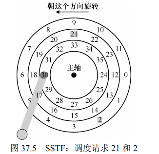


**电梯**
该算法最初称为 SCAN，简单地以跨越磁道的顺序来服务磁盘请求。我们将一次跨越磁盘称为扫一遍。因此，如果请求的块所属的磁道在这次扫一遍中已经服务过了，它就不会立即处理，而是排队等待下次扫一遍。
由于现在应该很明显的原因，这种算法（及其变种）有时被称为电梯（elevator）算法，因为它的行为像电梯，电梯要么向上要么向下，而不只根据哪层楼更近来服务请求。试想一下，如果你从 10 楼下降到 1 楼，有人在 3 楼上来并按下 4 楼，那么电梯就会上升到4 楼，因为它比 1 楼更近！如你所见，电梯算法在现实生活中使用时，可以防止电梯中发生战斗。在磁盘中，它就防止了饥饿。
> 关键问题：如何计算磁盘旋转开销
如何同时考虑寻道和旋转，实现更接近 SJF 的算法？

**SPTF：最短定位时间优先**
在这个例子中，磁头当前定位在内圈磁道上的扇区 30上方。因此，调度程序必须决定：下一个请求应该为安排扇区 16（在中间磁道上）还是扇区 8（在外圈磁道上）。接下来应该服务哪个请求？答案当然是“视情况而定”。
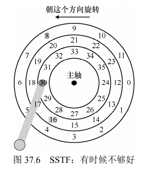

如果在我们的例子中，寻道时间远远高于旋转延迟，那么 SSTF（和变体）就好了。调用程序会先调度扇区16，再是扇区8。如果旋转延迟时间高于寻道时间，那么会先请求扇区8，然后是扇区16。

### 第38章 廉价冗余磁盘阵列（RAID）
> 我们使用磁盘时，有时希望它更快。I/O 操作很慢，因此可能成为整个系统的瓶颈。我们使用磁盘时，有时希望它更大。越来越多的数据正在上线，因此磁盘变得越来越满。我们使用磁盘时，有时希望它更可靠。如果磁盘出现故障，而数据没有备份，那么所有有价值的数据都没了。

廉价冗余磁盘阵列（Redundant Array of Inexpensive Disks），更多时候称为RAID，这种技术使用多个磁盘一起构建更快、更大、更可靠的磁盘系统。
RAID系统分级：
- RAID-0：条带化（striping）
- RAID-1：镜像（mirror）
- RAID-4：通过奇偶校验（parity）节省空间
- RAID-5：旋转奇偶校验

**从以下三个方面评估RAID性能**
- 容量（capacity）
- 可靠性（reliability）
- 性能（performance）

#### RAID-0：条带化
RAID-0条带化，其中块0~3为一条带（stripe）。
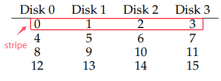
如果大块为2（chunk size=2），如下所示，小块0~7号构成一条带。
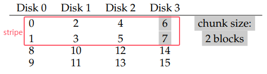

**评估RAID-0**
从容量上来看0级的容量为 $N*B$（N个磁盘都可用，每个磁盘都有B个块）；可靠性差：任何磁盘故障都会导致数据丢失；性能非常好：通常并行使用所有磁盘来为用户 I/O 请求提供服务。

#### RAID-1：镜像
4块磁盘其中两块磁盘（如磁盘0和磁盘1）的数据是一样的，这样的设计提高了数据的可靠性。
从镜像阵列读取块时，RAID 有一个选择：它可以读取任一副本。例如，如果对 RAID发出对逻辑块5的读取，则可以自由地从磁盘 2 或磁盘 3 读取它。但是，在写入块时，不存在这样的选择：RAID 必须更新两个副本的数据，以保持可靠性。但请注意，这些写入可以并行进行。例如，对逻辑块 5 的写入可以同时在磁盘 2 和 3 上进行。
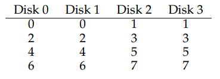

#### RAID-4：通过奇偶校验节省空间
4级系统多用了一块磁盘来存储前面磁盘的冗余信息。例如，磁盘4的P0块存储的是由块0~3构成的条带的冗余信息。
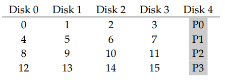

使用异或（XOR）来计算奇偶校验位相当不错。任何一行中的1的数量必须是偶数（而不是奇数）。
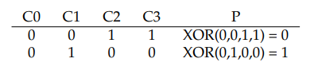

将异或用于块：
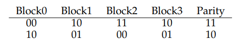

利用奇偶校验位可以实现数据的恢复，已知校验块的冗余数据，可以计算出某一个块的编号。RAID-4 容许1个磁盘故障，不容许更多。如果丢失多个磁盘，则无法重建丢失的数据。

#### RAID-5：旋转奇偶校验 


#### RAID总结
四种RAID性能、可靠性、容量表格如下所示：
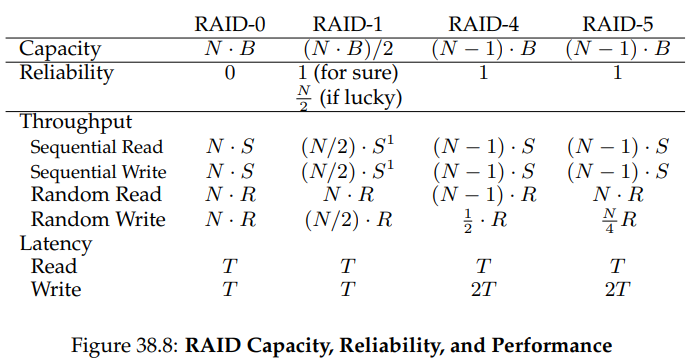

[Linux C API参考手册](https://wizardforcel.gitbooks.io/linux-c-api-ref/content/index.html)